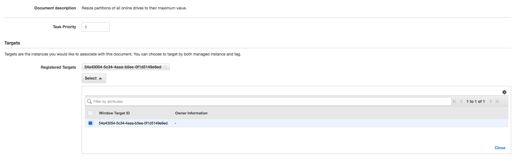

#Setup
###Upload the powershell Script to EC2 Systems Manager

[AWS Docs] [Creating Systems Manager Documents](http://docs.aws.amazon.com/AWSEC2/latest/UserGuide/create-ssm-doc.html)

The document can be uploaded with the following CLI command. 
You can replace ResizeFS with a name of your choice:

```
aws ssm create-document --content file://Set-MaximumPartitionSize.ps1_encoded.json --document-type Command --name "ResizeFS"
```

### Configure the maintenance window
[AWS Docs] [Creating a Maintenance Window](http://docs.aws.amazon.com/AWSEC2/latest/UserGuide/sysman-maintenance-create.html)

Create a new maintenance window according to your requirements

 

#### Create a target group

Register targets based on the Maintenance Tag which will be later defined in the Lambda function


#### Select the document as task

Register a task to execute the Script on the target group



### Create the lambda function

Create a new Empty Python Lambda function and paste the function code from [tag_instance.py](../tag_instance.py) into the inline editor.
Define the maintenance Tag in the two environment variables **Tagname** and **Tagvalue**


Create a custom IAM role and replace the policy document with the one provided in [lambda_role.json](../lambda_role.json)


### Setup the CloudWatch Event trigger

Create a Cloud Watch Event Rule that will trigger the Lambda Function each time an EBS volume is resized


### Verify the execution
The correct execution of the lambda function can be verified from its Cloudwatch log:


The maintenance Window Task will report a Success in its History Panel when the script executes.


The execution log of the Powershell Script can be found in the C:\Program Files\Amazon Folder on each instance


 

